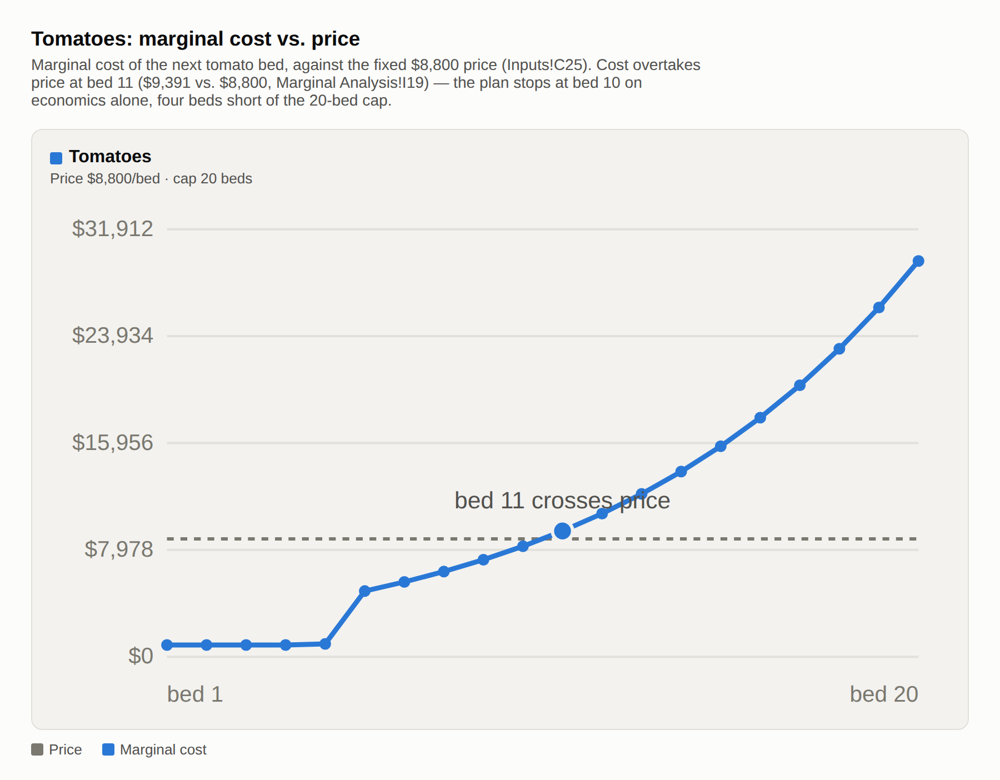
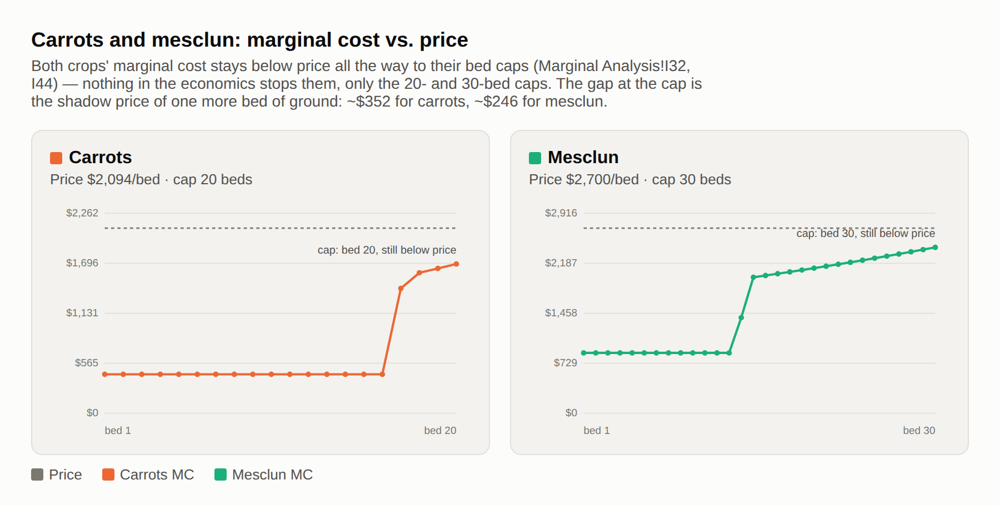

# Perfect competition — analysis

## 1. Why tomatoes stop at ~10 beds despite being the money crop

Revenue per bed ($8,800 for tomatoes, `Inputs!C25`) is a constant price, and it doesn't change no matter how many beds you plant. Marginal cost is the opposite and the cost of the next bed specifically, and in this model it rises steeply as you plant more tomato beds, for two compounding reasons baked into the Inputs sheet.

Tomatoes have a "diminishing returns" rate of 10% per bed (`Inputs!F25`) — the highest of the three crops (carrots are 2.5%, `Inputs!F26`, four times lower). In this model that shows up as each additional tomato bed needing more labor hours than the last.

The farmer only has 720 hours of "free" field time (`Inputs!B14`) before any paid labor kicks in, and tomatoes burn through that allotment fast because each bed takes an increasing amount of it. The farmer's free hours run out at bed 5 (`Marginal Analysis!E9:E20`, the Free hours column). From bed 6 onward, every hour of that rising labor requirement is paid at the temp-worker rate ($17.36/hr, `Inputs!B20`). Since the hours needed per bed are themselves growing, the dollar cost per additional bed grows even faster.

Tracing the actual marginal cost column bed by bed shows the crossing directly (Figure 1):

Bed 9 costs about $7,244 to add (`Marginal Analysis!I17`) — still comfortably under the $8,800 price, earning about $1,556 of marginal profit. Bed 10 costs $8,248.59 (`Marginal Analysis!I18`; matches the Engine sheet's audit check at `Engine!B24`) — still under price, but only by $551. Bed 11 costs $9,390.72 (`Marginal Analysis!I19`) — now above the $8,800 price, so planting it would lose about $591. That's the exact crossing point you described: marginal cost sits below $8,800 through bed 10 and above it at bed 11, so a profit-maximizing farmer plants exactly through bed 10 and stops, regardless of the fact that 20 beds are allowed.

That's the whole mechanism of P = MC for a price-taking producer: price is fixed by the market and acts as marginal revenue, so the profit-maximizing quantity is wherever the rising marginal-cost curve meets that fixed price line — not wherever revenue-per-unit happens to be highest. Carrots make the contrast obvious: their price is only $2,094 (`Inputs!C26`), a quarter of tomatoes', but because their diminishing-returns rate is so much gentler (2.5% vs 10%), their marginal cost is still comfortably below price even at bed 20, the cap (`Marginal Analysis!I32`). Carrots aren't stopped by economics at all — they're stopped by running out of allowed ground (the sheet even prices bed 21 at roughly $353 of profit it's leaving on the table, `Marginal Analysis!K33`). Tomatoes are the mirror image: high price, but a marginal cost curve that outruns even that high price by bed 11, so they're self-limiting well inside their cap. Being the best per-bed earner sets how high the bar is; it says nothing about how many beds it's worth clearing that bar for.

## 2. The tomato MC dip at ~bed 6, and why it's not a spreadsheet error

Marginal cost doesn't just climb through bed 11 — it climbs, dips, then climbs again. Charging the farmer's own hours at her $34.72/hr opportunity cost (`Inputs!B15`) instead of treating them as free at the margin, beds 1–5 climb steeply, driven by the expensive farmer rate: $4,317.50 → $5,005.00 → $5,795.63 → $6,703.13 → $7,660.86 (`Marginal Analysis!I9:I13`). Then bed 6 falls to $4,906.28 (`Marginal Analysis!I14`) once every hour of that bed is priced at the cheaper $17.36/hr temp rate instead (`Inputs!B20`) — a genuine wage-driven dip — before diminishing returns push it back up through the same bed 7–11 path already traced in Finding 1. Both segments agree from bed 6 onward; they only disagree on beds 1–5, since that's the only range where the farmer's own hours are actually in play.

Diminishing returns never paused here — hours per bed keep rising the whole way (`Marginal Analysis!D9:D14`, the Marginal hours column). What changed is the price of the marginal hour, not the physical returns: the farmer's 720 free field hours (`Inputs!B14`) run out partway through bed 5, cheaper temp labor takes over, and for one bed that wage drop outweighs the extra hours needed. An analysis that treated MC as rising monotonically would have missed this.

## 3. Which constraints bind, and what relaxing one is worth

Carrots and mesclun are cap-limited (Figure 2): their marginal cost is still comfortably below price at the last bed the cap allows (bed 20 for carrots, `Marginal Analysis!I32`; bed 30 for mesclun, `Marginal Analysis!I44`), so nothing in the economics tells them to stop, just the 20-bed and 30-bed caps (`Inputs!B26`, `Inputs!B27`).

Bed 21 of carrots would earn $352.49 in profit (`Marginal Analysis!K33`), bed 31 of mesclun would earn $246.47 (`Marginal Analysis!K45`). Those are shadow prices in the strict LP sense, the value of loosening a binding constraint by one unit, and they're directly usable: if you could rent or convert one more bed of ground for tomatoes into carrot/mesclun ground, it's worth paying up to $352 or $246 for it, respectively. Tomatoes, by contrast, stop on economics alone at bed 10 (`Solver Model!B4`), well short of its 20-bed cap (`Inputs!B25`), so its bed cap isn't binding and has no shadow price. More tomato ground is worth $0 to this plan.

The other two constraints in the model, total beds (64, `Inputs!B5`) and temp labor hours (4 workers × 1,440 hrs = 5,760 hrs, `P&L!B13`) both sit with slack at the optimum: 60 of 64 beds used (`Solver Model!B7`), and about 5,277 of 5,760 labor-hours used (`P&L!B9`, ~483 hours to spare). Neither is what's stopping any crop, so their shadow price is $0. Paying for a bigger plot or a 5th temp worker wouldn't change the plan or the profit at all.

## 4. Why grow crops that lose money on their own

MC stayed below price at every single carrot bed (through 20) and every mesclun bed (through 30) — the "Profitable?" column reads "Yes" the whole way (`Marginal Analysis!L28:L33`, `Marginal Analysis!L40:L45`). Since average variable cost is just the average of all those per-bed marginal costs, and every one of them stays below price, AVC must stay below price too. You can't average a column of numbers that are all below a line and land above it. That's the short-run shutdown rule directly: produce as long as price covers AVC, because the fixed cost gets paid either way.

And the $20,000 really is farm-wide and singular in the Inputs (`Inputs!B8`), one number, not one per crop. A standalone P&L that charges the full $20,000 against carrots alone is asking one crop to carry all the weight. Once carrots and mesclun are grown together with tomatoes, that $20,000 is being paid regardless of the planting decision, so it's irrelevant to whether one more bed of carrots is worth planting. The only question that bed answers is "does its own price beat its own marginal cost," and for every carrot and mesclun bed up to the cap, then yes — which is exactly why total profit lands at $42,761.66 (`P&L!B22`) rather than being dragged down to zero by the fixed cost. It's the same reasoning as the half-empty airline route: the plane and crew are sunk cost for the flight either way, so any fare above the cost of that one extra passenger's fuel and meal is pure profit, even though the flight "loses money" if you insist on dividing the airline full cost by the empty seats.

## Against the Stage 1 hypothesis

I predicted 7 tomatoes / 18 carrots / 22 mesclun (47 beds); the model found 10 / 20 / 30 (60 beds), earning $42,762 — $8,529 more than my guess. I was wrong on all three crops, not just one, because I balanced them on intuition instead of checking either real limit: labor had slack (2,651 of 5,760 hours used), and no crop's marginal cost had actually caught up to its price. Mesclun was the worst miss, stopped at 22 beds against a true optimum of 30, even though its marginal cost never gets close to price all the way to the cap.
