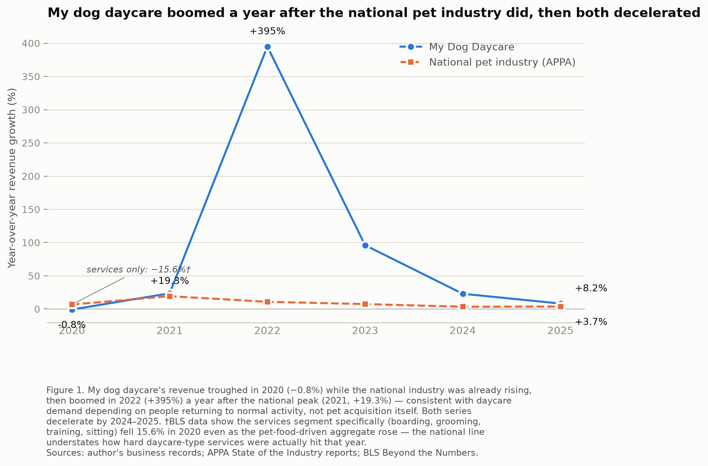
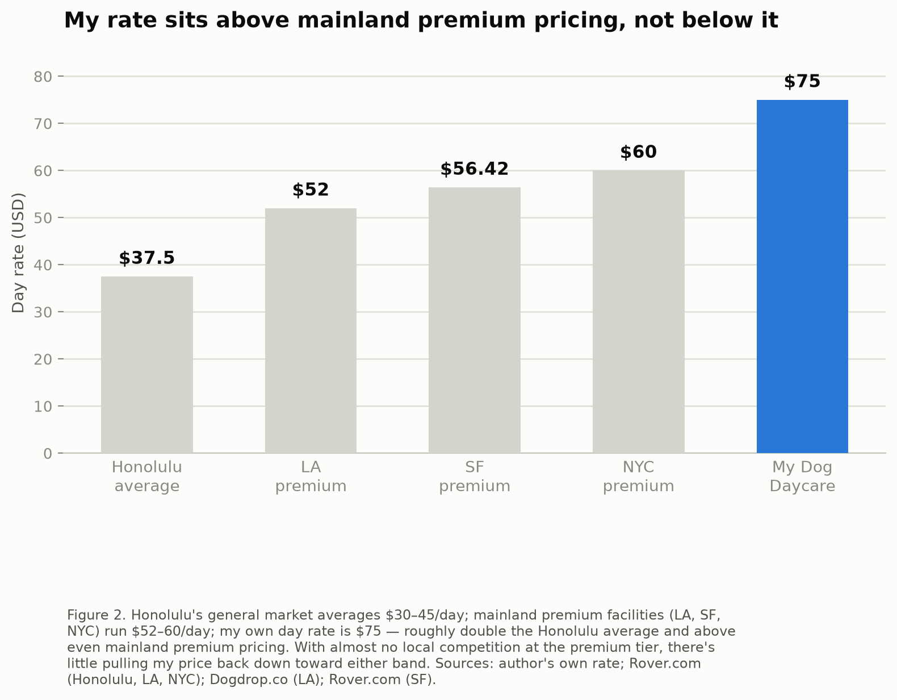

**A Post-COVID Fading Boom: Cohort-Driven Demand and the Limits of Premium Pricing in Hawaii's Dog Daycare Market**

# Introduction

My dog daycare has reached a point where the pricing and positioning decisions I made in survival mode no longer fit the market I am actually operating in. Growth decelerated from 96.0% year-over-year in 2023 to 22.9% in 2024 and 8.2% in 2025, and the question in front of me now is not whether to grow at any cost but how to price and position a mature business in a market that has stopped expanding. That is the decision this paper is built to inform.

My business did not arrive at this question smoothly. In March 2020, mandatory lockdowns emptied the business almost overnight. Daycare has little value to a dog whose owner is suddenly home all day. Surviving meant discounting services for essential workers who still needed to leave the house for work. The business came close to not making it through that year; revenue fell only 0.8% year-over-year in the official count, a modest-looking number that understates how close the operation came to closing. Then, as the initial work-from-home period wound down and owners who had acquired "covid puppies" began returning to offices, those dogs' separation anxiety and lack of socialization created sudden, urgent demand: revenue grew 395% in 2022 and another 96.0% in 2023. That boom has now largely run its course, and the business sits at a fork: hold pricing that was essentially born out of a demand shock, or deliberately re-price and re-position for the market that is actually here now.

# Economic Framework

Three concepts frame this decision.

**Income elasticity of demand** describes how a good's demand responds to changes in income or disposable spending. Dog daycare is discretionary. Nobody really needs a dog walked and socialized to survive, which makes it a good with high income elasticity. Demand contracts disproportionately when household budgets tighten. That elasticity is part of what the 2020 collapse actually was: discretionary spending got cut first as households faced sudden income uncertainty, not a judgment against daycare specifically. It also remains a risk going forward. A recession or a tightening local economy would be expected to hit daycare revenue harder than overall local spending, independent of anything the business does on pricing or marketing.

**Market structure and barriers to entry** describe how easily new competitors can enter a market and constrain pricing power. In most mainland cities, land for a daycare facility (yard space, indoor play area, parking) is relatively abundant, so new entrants can open competing premium facilities whenever demand supports them, and that competition holds premium prices in a narrow band. Hawaiʻi's land scarcity is a structural constraint on every operator's ability to expand, and on new entrants' ability to open competing facilities at all, which is a reason prices in this specific market could sit higher than the mainland, not lower.

**Tastes and preferences** describe how much a given population values a good/service in the first place, independent of what it can afford or what is available to buy. Dogs appear to be a lower cultural priority in Hawaiʻi than on the mainland. Dog ownership is less central to lifestyle and status signaling here than in many mainland markets, and the comparative lack of dog-friendly infrastructure (dog parks, dog-friendly retail, pet-focused real estate) is a symptom of that lower priority, not its cause.

# Analysis

## The timing lag as mechanism evidence

Figure 1 lines up my own year-over-year revenue growth against the American Pet Products Association's (APPA) national pet industry growth rate from 2020 through 2025. (2019 is excluded on both sides: my own 2019 figure, +888%, is a startup-year base-effect artifact against a near-zero 2018 base, and the APPA series has no comparable prior-year figure for 2019 either.) The two lines are not supposed to move together, and the gap between them is itself evidence for how daycare demand actually works.

My own revenue troughed in 2020 (−0.8%) in the same year the national industry was already rising (+6.7%, reaching +19.3% by 2021) (Supermarket News, 2021). That divergence follows from what each series measures: the national APPA total is dominated by pet food, supplies, and veterinary spending, which rose because people stuck at home were acquiring pets. Daycare is the opposite kind of good — it has little value to an owner who is already home all day, so the same lockdown conditions that lifted national pet spending crushed my own business. The U.S. Bureau of Labor Statistics' pet-care-services output series (NAICS 812910 — boarding, grooming, training, and sitting, excluding pet food and veterinary spending) fell 15.6% from 2019 to 2020 (U.S. Bureau of Labor Statistics, 2021), a far closer match to my own experience that year than the APPA aggregate, and a sign that the aggregate understates how hard daycare-type services specifically were hit.

My own boom did not arrive until 2022 (+395%) and 2023 (+96.0%) — a full year after the national industry's 2021 peak — because daycare demand depends on people leaving the house again, not on the initial wave of pet acquisition. The one-year lag between the two series is the mechanism evidence: daycare followed return-to-office timing, one step behind the broader industry's pandemic-acquisition boom.

Both lines also decelerate together by 2024–2025: the national industry's growth fell from 10.8% in 2022 to 3.4% in 2024, ticking up slightly to 3.7% in 2025 (American Pet Products Association, 2026), while my own growth fell from 96.0% in 2023 to 22.9% in 2024 to 8.2% in 2025. That small national uptick in 2025 could look like the deceleration reversing, but 3.7% is still barely a third of 2022's 10.8% — a minor bounce inside a much larger decline, not a trend change. The fact that a national industry aggregate and one specific Hawaiʻi daycare business decelerate on the same timeline, despite measuring very different things, is the strongest evidence available that the 2024–2025 slowdown is a broad normalization and not something specific to how this business is being run. Hawaiʻi's own unemployment rate tightened over this same window — from roughly 3.3% in 2022 to about 2.5% in 2025 (Hawaiʻi Department of Business, Economic Development & Tourism, 2026) — which rules out a weakening local economy as the explanation for the plateau; if anything, the local labor market strengthened while growth decelerated, consistent with demand normalization rather than an income-elasticity shock for this period.

## A cohort effect, not client attrition

That normalization is best explained by a cohort effect. The 2022–2023 boom was driven by a specific cohort of dogs acquired in 2020–2021 who needed intensive behavioral socialization once their owners returned to normal schedules; as those dogs matured and settled into routines, their owners' reliance on daily daycare would be expected to taper off even without losing the client relationship. The mechanism is maturation — dogs aging out of acute separation anxiety as they settle in, not mortality or client attrition. This is a specific, falsifiable claim. It would be wrong if growth had kept accelerating rather than decelerating, or if the clientele's age mix had stayed dominated by the original 2020–21 cohort instead of skewing toward younger dogs as new clients replace graduating ones. The deceleration pattern in Figure 1, together with a clientele that in practice skews younger over time rather than aging in place, is consistent with the maturation story and inconsistent with the pattern that would falsify it.

A third-party source independently supports the same mechanism. Grand View Research's report on the U.S. pet daycare market attributes day boarding's majority market share in 2024 to, in the report's own words, "pet parents returning to office post-COVID" (Grand View Research, 2024) — a market research firm naming the identical return-to-office mechanism behind the pattern in Figure 1, arrived at independently of this business's own data.

## The pricing reversal

Figure 2 addresses the pricing and positioning question directly, and it overturns the hypothesis this analysis started with. The original expectation was that Hawaiʻi's dog-care market lags mainland "bougie" pricing — that premium rates here would sit below what equivalent mainland facilities charge, and that the open question was how much room there was to raise prices toward that mainland benchmark. The actual numbers say the opposite. My own day rate of $75 sits above every mainland premium benchmark gathered (Los Angeles $52, Dogdrop.co, n.d.; San Francisco $56.42, Rover.com, n.d.-c; New York $60, Rover.com, n.d.-b) and roughly double Honolulu's general-market average of $37.50 (Rover.com, n.d.-a). The finding changed once the real numbers were in: the story is not "Hawaiʻi hasn't caught up to mainland premium pricing", it is that Hawaiʻi barely has a premium tier at all.

This is where market structure and tastes/preferences, introduced as two separate concepts, resolve into a single explanation at different points on the price ladder. Mainland cities support enough premium demand to sustain a deep field of competing high-end operators, and that competition holds prices in a narrow $52–60 band and new entrants keep any one operator from pricing meaningfully above it. Hawaiʻi does not have that competitive depth at the premium tier, a direct consequence of the land-scarcity barrier described above: there is simply not the available space for a deep field of competing premium operators to emerge and discipline prices the way they do on the mainland. That absence of competition is why my own price is not held down the same way mainland premium prices are. Tastes and preferences still explain why so few Hawaiʻi operators build toward the premium tier in the first place. Low cultural prioritization of dog care keeps most of the market in the $30–45 general band, but it does not explain my own price, which market structure does. The two concepts are not in tension; they operate at different points in the market. Tastes and preferences explain why Hawaiʻi's premium tier is thin; market structure explains why, having built into that thin tier, pricing power there is unusually strong.

# Recommendation

The pricing and positioning decision this paper opened with has one coherent answer, not two separate ones: hold premium pricing because it is protected by scarcity, and build the rest of the business around what that scarcity-driven position can support, while being honest about what it cannot fix.

**Hold the $75 day rate at the premium tier, or test raising it further.** This price is not sustained by broad mainland-style demand for premium dog care. Overall demand for premium care in Hawaiʻi is thin, it is sustained by the absence of competitors able to enter and underprice it, which Figure 2's gap above even the mainland premium band supports directly. There is no evidence in this analysis that broad demand growth will protect this price going forward; pricing power here comes from supply-side scarcity, not demand-side strength, and the recommendation should be understood and communicated that way.

**Add a mid-tier option below the premium tier,** built as vertical differentiation within one brand rather than as a separate discount product. The mid-tier would hold the same quality bar as the premium tier: admission testing, trained staff, the same orderly, clean, and respectful standards, differing only in removing field trips specifically. This is the same logic as airline cabin classes or a private school's academic tracks: the same underlying institution and standards, with the premium tier retaining one feature the mid-tier does not offer, rather than a cheaper product built to a lower standard. Structuring it this way protects against brand dilution. A "budget" product under the same name risks pulling the premium tier's reputation down with it, while a "same standards, fewer frills" mid-tier does not.

The mid-tier also carries a cost-side argument, not just a demand-segmentation one. Field trips are the most staff-intensive part of the premium service, requiring dedicated staff time away from the facility per outing, so a mid-tier without them likely carries a meaningfully lower marginal staffing cost per dog. That means the mid-tier could post a comparable margin per dog than the premium tier even at a lower price point, which makes it attractive on cost grounds independent of whether it also captures price-sensitive clients who would otherwise go to a $30–45 general-market competitor instead of to this business at all.

**Bundle grooming and training onto the premium (and mid-tier) client relationship.** This is an economies-of-scope argument: the same client base that already trusts the business with daily care is a natural audience for adjacent services, and capturing more of each existing relationship's spending is cheaper than acquiring a new client for a freestanding grooming or training business. Training, in particular, is not a hypothetical addition. A partner is already ready to trade on-site housing for providing the training classes to "paw-rents," plus overnight safety coverage.

**Add a small retail offering at the front of house** — treats (we already have a pet nutritionist on staff), toys, safety gear and brand merchandise. This is a direct, business-scale answer to the exact gap the tastes-and-preferences analysis identified in the broader Hawaiʻi market: a shortage of dog-friendly infrastructure. The business cannot fix that gap for the island, but it can close it for its own clients and capture retail revenue from the foot traffic the daycare already generates.

The strongest objection to this plan is land scarcity, and it deserves a direct answer rather than a smoothed-over one. The same barrier-to-entry constraint that protects the premium price is also the constraint standing in the way of the mid-tier's added capacity and the retail floor space. Training's staffing need is solved by the existing housing-for-service arrangement, but training, the mid-tier, and retail still compete for the same scarce square footage the premium tier already occupies. This plan does not resolve that constraint.

That same constraint closes the loop on the paper's central argument. This business has an established brand, revenue, and a staffing partner already in place for training — and still, finding additional space in this market is hard. That difficulty is not a shortcoming of this particular plan; it is itself evidence for the market-structure argument made throughout this paper. Land really is the barrier to entry in Hawaiʻi's dog daycare market, not just a theoretical one, and that scarcity is simultaneously the reason this business can hold a premium price no mainland-style competition would let it hold, and the reason its own expansion plans are constrained by the same force.

# References

American Pet Products Association. (2026). U.S. pet industry reaches $158 billion in 2025, poised for continued growth in 2026. https://americanpetproducts.org/news/the-american-pet-products-association-appa-releases-2025-state-of-the-industry-report

Dogdrop.co. (n.d.). How much does dog daycare cost in 2026? A complete price guide. Retrieved 2026, from https://www.dogdrop.co/blog/how-much-does-dog-daycare-cost

Grand View Research. (2024). U.S. pet daycare market size, share & trends analysis report, 2025–2030. https://www.grandviewresearch.com/industry-analysis/us-pet-daycare-market-report

Hawaiʻi Department of Business, Economic Development & Tourism. (2026). Unemployment statistics. https://dbedt.hawaii.gov/economic/unemployment-statistics/

Rover.com. (n.d.-a). How much does dog daycare cost in Honolulu, HI? Retrieved 2026, from https://www.rover.com/blog/honolulu-hi-dog-daycare-price/

Rover.com. (n.d.-b). How much does dog daycare cost in New York City, NY? Retrieved 2026, from https://www.rover.com/blog/new-york-city-ny-doggy-day-care-price/

Rover.com. (n.d.-c). How much does dog daycare cost in San Francisco, CA? Retrieved 2026, from https://www.rover.com/blog/san-francisco-ca-doggy-day-care-price/

Supermarket News. (2021, March 23). Pet industry sales in 2020 surpass $100 billion for first time. https://www.supermarketnews.com/consumer-trends/pet-industry-sales-in-2020-surpass-100-billion-for-first-time

U.S. Bureau of Labor Statistics. (2024). A "tail" of productivity in pet care services: New technology enables rapid growth [Beyond the Numbers]. https://www.bls.gov/opub/btn/volume-13/a-tail-of-productivity-in-pet-care-services-new-technology-enables-rapid-growth.htm
